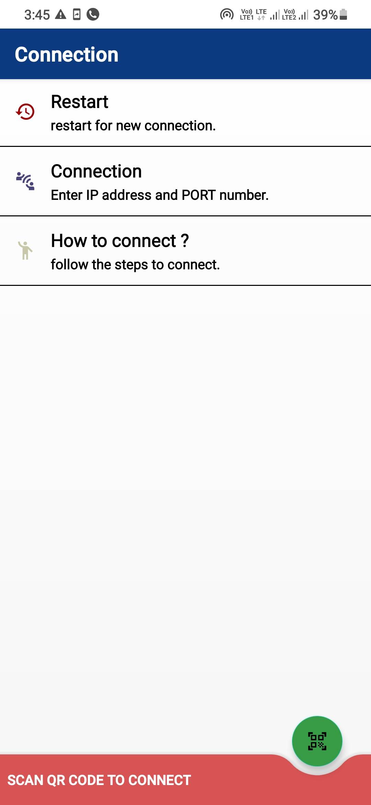

# PCOID - PC Remote Controller

# Available for windows, linux and mac.

### Features

1. Control Left Click, Right Click, Mouse Scroll
2. Type text 
3. Transfer files from phone to laptop
4. Download files from laptop to phone
5. media controls and brightness control
6. See images of phone on laptop
7. Control presentation on laptop via phone
8. Suspend, Restart or Shutdown your laptop using phone
9. Fetch your laptop screen to Android 
10. Browse Android files on Desktop 
11. Cast mobile screen to desktop
12.  Cast desktop camera to mobile
13.  Terminal control
14.  Video stream
15.  Audio stream
16.  Share URL to browser
17.  Gamepad
18.  Task manager
19.  App list
20.  moniter control

### Android app link

### Desktop app link
https://pcoid.github.io/pcoid/

## Screenshots
|  |  |
| --- | --- |
| | |
| | |
| | |
| | |
| | |
| | |
| | |

You should install a software on your pc . PCOID works on windows ,linux and mac. Download and install the pcoid software on pc .

PCOID is an app which allows you to remotly control your pc.

#Follow the steps to connect :

1. Open the PCOID software on your PC and make sure that the phone and the computer are on the same network for optimal performance (USB Tethering , Bluethooth PAN, Wifi , Hotspot).

2. Scan the QR code to connect.

3. Done.

Developed by pradeep.
